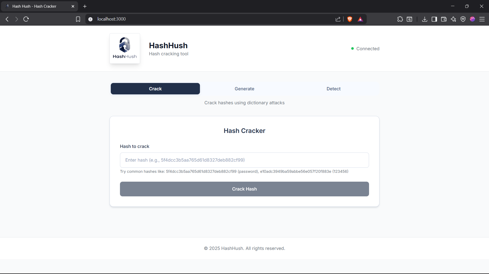

# Hash Hush 🔐

A modern, sleek hash cracking web application with a beautiful UI and powerful backend functionality.

## 🌐 Live Demo

**[🚀 Try HashHush Live](https://hashhush-production.up.railway.app/)**

# HashHush UI Preview



## ✨ Features

### 🔍 Hash Cracker
- Dictionary-based hash cracking
- Support for multiple hash algorithms (MD5, SHA-1, SHA-256, SHA-512, bcrypt, etc.)
- Custom dictionary support
- Auto-detection of hash algorithms
- Real-time cracking status

### 🏭 Hash Generator
- Generate hashes from text input
- Support for 8+ hash algorithms
- Batch hash generation
- Copy individual or all hashes
- Modern, responsive interface

### 🛡️ Hash Detector
- Automatic hash algorithm detection
- Security level assessment
- Detailed algorithm information
- Confidence scoring

### 🌙 Dark Mode
- **Automatic Theme Detection** - Respects system preferences
- **Manual Theme Toggle** - Beautiful animated sun/moon button
- **Persistent Settings** - Remembers your theme choice
- **Smooth Transitions** - 300ms animations for all color changes
- **Glass Morphism** - Enhanced visual effects in dark mode
- **Accessibility** - Better contrast and reduced eye strain

## 🚀 Quick Start

### Prerequisites
- Node.js (v16 or higher)
- npm or yarn

### Installation

1. **Clone the repository**
   ```bash
   git clone <repository-url>
   cd HashHush
   ```

2. **Install all dependencies**
   ```bash
   npm run install-all
   ```

3. **Start the development servers**
   ```bash
   npm run dev
   ```

4. **Open your browser**
   - Frontend: http://localhost:3000
   - Backend API: http://localhost:5000

## 📁 Project Structure

```
HashHush/
├── client/                 # React frontend
│   ├── src/
│   │   ├── components/     # React components
│   │   │   └── ThemeToggle.tsx  # Dark mode toggle
│   │   ├── contexts/       # React contexts
│   │   │   └── ThemeContext.tsx # Theme management
│   │   ├── App.tsx         # Main app component
│   │   ├── index.tsx       # Entry point
│   │   └── index.css       # Global styles with dark mode
│   ├── package.json
│   └── tailwind.config.js  # Tailwind with dark mode config
├── server/                 # Node.js backend
│   ├── index.js           # Main server file
│   └── package.json
├── package.json           # Root package.json
└── README.md
```

## 🛠️ Technology Stack

### Frontend
- **React 18** with TypeScript
- **Tailwind CSS** for styling with dark mode support
- **Lucide React** for icons
- **Context API** for theme management
- **Modern UI/UX** with glass morphism effects

### Backend
- **Node.js** with Express
- **Crypto-js** for hash generation
- **bcrypt** for password hashing
- **Security middleware** (helmet, rate limiting, CORS)

## 🌙 Dark Mode Features

### Automatic Detection
- **System Preference**: Automatically detects your OS dark mode setting
- **Local Storage**: Remembers your theme choice across sessions
- **Real-time Updates**: Responds to system theme changes

### Theme Toggle
- **Animated Button**: Beautiful sun/moon icon with rotation effects
- **Smooth Transitions**: 300ms animations for all color changes
- **Accessible**: Proper ARIA labels and keyboard navigation

### Color Schemes

#### Light Mode
- **Background**: `#f7faff` (light blue-gray)
- **Surface**: `#ffffff` (white)
- **Text**: `#22304a` (dark blue-gray)
- **Primary**: `#22304a` (dark blue)

#### Dark Mode
- **Background**: `#0f172a` (dark slate)
- **Surface**: `#1e293b` (slate-800)
- **Text**: `#f1f5f9` (slate-100)
- **Primary**: `#60a5fa` (blue-400)

### Implementation Details
- **CSS Custom Properties**: Complete theming system
- **Tailwind Integration**: Class-based dark mode with `dark:` prefixes
- **Context API**: React context for theme state management
- **Performance**: Optimized with minimal re-renders

## 🔧 Available Scripts

### Root Directory
- `npm run dev` - Start both frontend and backend in development mode
- `npm run install-all` - Install dependencies for all packages
- `npm run build` - Build the frontend for production
- `npm start` - Start the production server

### Client Directory
- `npm start` - Start React development server
- `npm run build` - Build for production
- `npm test` - Run tests

### Server Directory
- `npm run dev` - Start server with nodemon
- `npm start` - Start production server

## 🌐 API Endpoints

### Health Check
- `GET /api/health` - Check API status

### Hash Detection
- `POST /api/detect` - Detect hash algorithm type
  ```json
  {
    "hash": "5f4dcc3b5aa765d61d8327deb882cf99"
  }
  ```

### Hash Generation
- `POST /api/generate` - Generate hash from text
  ```json
  {
    "text": "password",
    "algorithm": "md5"
  }
  ```

### Hash Cracking
- `POST /api/crack` - Crack hash using dictionary
  ```json
  {
    "hash": "5f4dcc3b5aa765d61d8327deb882cf99",
    "algorithm": "md5",
    "dictionary": ["password", "123456"]
  }
  ```

### Algorithms
- `GET /api/algorithms` - Get supported algorithms

## 🎨 UI Features

- **Glass Morphism Design** - Modern, translucent UI elements
- **Responsive Layout** - Works on desktop, tablet, and mobile
- **Dark Mode Support** - Beautiful light and dark themes
- **Smooth Animations** - CSS transitions and micro-interactions
- **Copy to Clipboard** - One-click hash copying
- **Real-time Feedback** - Loading states and error handling
- **Theme Persistence** - Remembers your theme preference

## 🔒 Security Features

- **Rate Limiting** - Prevents abuse with request limits
- **CORS Protection** - Configurable cross-origin requests
- **Helmet Security** - HTTP headers for security
- **Input Validation** - Server-side validation for all inputs
- **Error Handling** - Graceful error responses

## 🚀 Production Deployment

### Railway Deployment (Recommended)

Railway is a modern platform that makes it easy to deploy full-stack applications. Follow these steps to deploy HashHush:

1. **Install Railway CLI** (optional but recommended)
   ```bash
   npm install -g @railway/cli
   ```

2. **Login to Railway**
   ```bash
   railway login
   ```

3. **Initialize Railway project**
   ```bash
   railway init
   ```

4. **Deploy to Railway**
   ```bash
   railway up
   ```

5. **Set environment variables** (in Railway dashboard or CLI)
   ```bash
   railway variables set NODE_ENV=production
   ```

6. **Get your deployment URL**
   ```bash
   railway domain
   ```

The application will be automatically built and deployed. Railway will:
- Install all dependencies (root, server, and client)
- Build the React frontend
- Start the Node.js server
- Serve the built React app from the Express server
- Provide a public URL for your application

### Manual Deployment

### Environment Variables
```bash
NODE_ENV=production
PORT=5000
```

### Build for Production
```bash
# Install dependencies
npm run install-all

# Build frontend
npm run build

# Start production server
npm start
```

### Docker Deployment (Optional)
```dockerfile
FROM node:18-alpine
WORKDIR /app
COPY package*.json ./
RUN npm run install-all
COPY . .
RUN npm run build
EXPOSE 5000
CMD ["npm", "start"]
```

## 🤝 Contributing

1. Fork the repository
2. Create a feature branch (`git checkout -b feature/amazing-feature`)
3. Commit your changes (`git commit -m 'Add amazing feature'`)
4. Push to the branch (`git push origin feature/amazing-feature`)
5. Open a Pull Request

## 📝 License

This project is licensed under the MIT License - see the [LICENSE](LICENSE) file for details.

## ⚠️ Disclaimer

This tool is intended for educational purposes and legitimate security testing only. Always ensure you have proper authorization before attempting to crack any hashes. The developers are not responsible for any misuse of this application.

## 🆘 Support

If you encounter any issues or have questions:

1. Check the [Issues](https://github.com/your-repo/issues) page
2. Create a new issue with detailed information
3. Include your environment details and error messages

---

**Hash Hush** - Modern Hash Cracking Made Beautiful 🎨 